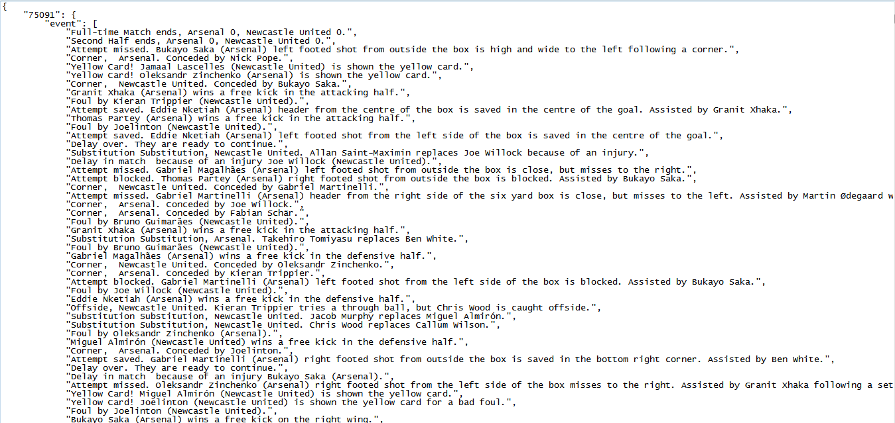
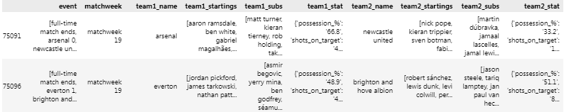

# App Data (JSON) Analysis Tool

## Motivation
Motivation for creating this repo is to create a python class that has methods which can bring insights from semi-structured dataset gathered from an sports app.

## Scenario (Current Situation)
A BI team who is looking for to gather quick insights from a semi structured data applying to a data analyst for a tool creation to gather needed insight quickly.
Used dataset covering 19 weeks of 2022-2023 Premier league season

### Source Dataset Definition (RAW)

### Source Dataset Definition Flattened Dataframe

* Columns of Flattened Dataframe
  * Index Col: Game Id
  * event: All actions taken in a game stored in a list
  * matchweek : matchweek of season
  * team1_name : home team name
  * team1_startings : starting lineup of home team saved in a list
  * team1_subs : subs of home team saved in a list
  * team1_stats : home team general stats on game e.g possesion, shots on target etc.
  * team2_name : away team name
  * team2_startings : starting lineup of away team saved in a list
  * team2_subs : subs of away team saved in a list
  * team2_stats : away team general stats on game e.g possesion, shots on target etc.

### Needed Insights
- A method that brings team name as parameter and returns amount of goals that selected team scored
- Percentage of total goals in league of selected team
- Total shoots team made during entire season
- Shot to Goal accuracy of team
- Top 10 players that has most starting lineups
- Score distribution of all teams in the league in a dataset

## Task Executed (Target Situation)
For to get needed insights from source data 2 python class and 1 python module created and used.
Two class called goal analyzer and lineups located in stats finder module (https://github.com/Giray18/sports_app_data_analysis_tool/tree/main/stats_finder) created and used.
1 function (read_df_json) from python module (dat) located on https://github.com/Giray18/sports_app_data_analysis_tool/tree/main/dat used to read JSON data into flattened pandas dataframe structure.
Usage examples of classes can be found on jupyter notebook located on (https://github.com/Giray18/sports_app_data_analysis_tool/blob/main/playground.ipynb)

As a result quick data analysis of semi-structured data done by a python class and methods within class.

